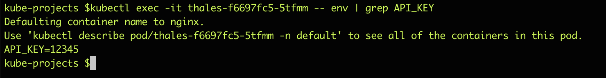
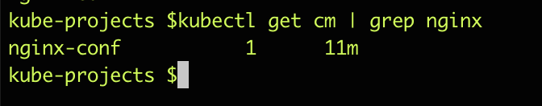
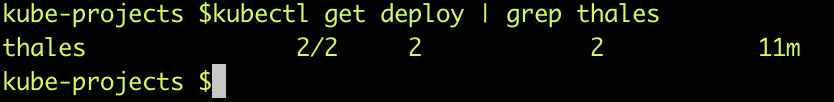
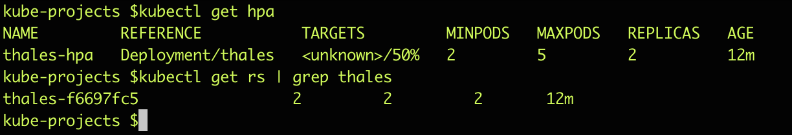
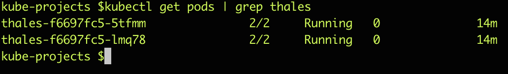
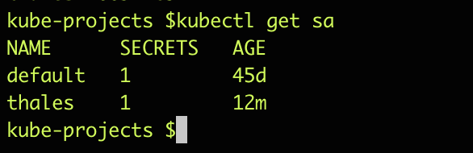
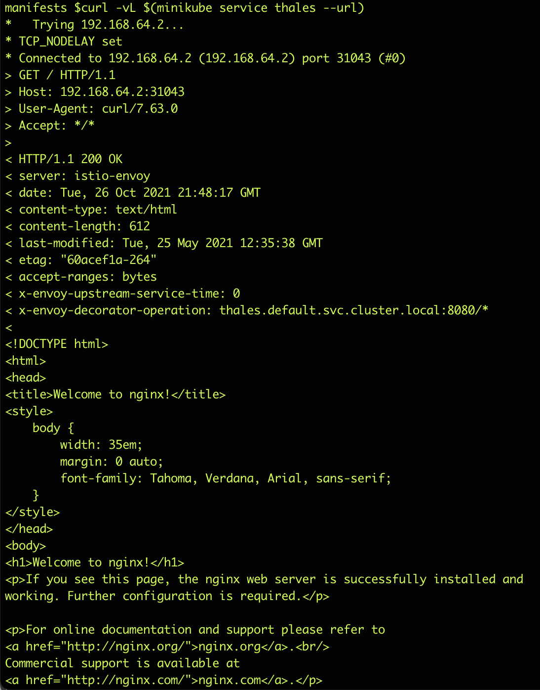

## Thales Infinite Challenge - DevOps
Please complete one of the following tasks. Each task should take no more than 2 hours. The task will have
to target below concepts when

1. Building infrastructure
2. Building applications
3. Building CI/CD pipeline
Do any 1 of the below task

#### Task Picked 1

Your task is to create a repo in github and solve below problem

    *  Create a kubernetes deployment, svc, hpa, pdb service account in kubernetes cluster. can be PaaS/Minikube
    * Deployment needs a secret with name API_KEY
    *  Mount this secret in deployment
    * API_KEY should be a environment variables within the contianer when contianer starts inside a pod
    * API_KEY env variable is not used yet in app, but we want to see the approach

#### Acceptance criteria
You must provide your code in full with kubernetes manifests or pipelines or scripts
    
         * Added manifest file 
 
You must use either public cloud(AWS, GCP, Azure) or Minikube to run the above manifests file.
        
        * Used Minikube for build and test 

You do not need to provide access to the cluster in public cloud, only the code
Your code is clean and readable

    * I have created dedicated file for each api resources  

You must document any steps that are not automated in the README.md

    * I have automated everything 
    * github actions:  
        1. Kube-score  scans the current deployments and shows warning, critical deprecated informations
        2. Minikube picks files from manifests and deploys 
         
You must have dedicated service account for deployment

    * Created dedicated SA and attached with deployment
    
You must have NodePort Type of service for application
You must have Minimum 2 pods always up and running
You must have only 1 pod unavailable during Rolling Update of Deployment

##### Assumptions
1. Can use any open-source tools/language to solve problem
2. Create extra code if needed like infra(terraform, scripts) etc in same repo
. Choose simple applications from internet e.g. nginx, httpd
##### Bonus
1. Deployment container is scanned before getting deployed. If severity is high, pipeline should fail
2. Container in Pod, should not be running as root

        *  Pods running with nginx user ( id:101) 
               
. Provide any code that you required to accomplish this task

        * Updated the repo with simple code 
          
. You must document any steps that are not automated in the README.md

        * I have automated everything. I have attached results as images 
         Note : I have istio running on my local and it injected sidecar proxy container in every pod. Please don't confuse when you see 2 cotainers instead of 1 from screenshots. 
 
 ### Results 
 
    
    
    
    
    
    
    
         
 ## File structure  
 
    .github/workflows - contains github actin work flow
       a. kube-score check all resources deployed on miniube and displays errors
       b. It runs the manifests file on minikube 
       
    manifests  - files required for task 1
    |     
    | -  configMap.yaml  
    | -  deployment.yaml 
    | -  hpa.yaml        
    | -  net-pol.yaml    
    | -  pdb.yaml        
    | -  sa.yaml         
    | -  secrets.yaml    
    | -  svc.yaml
  
     root files: 
     
      actions.yml  - Required for kube-score
      kube-score/lib/index.js - Predefined js to run scanning againt kubernetes resources 
      